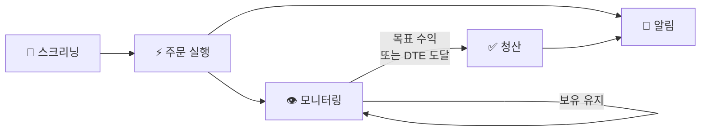
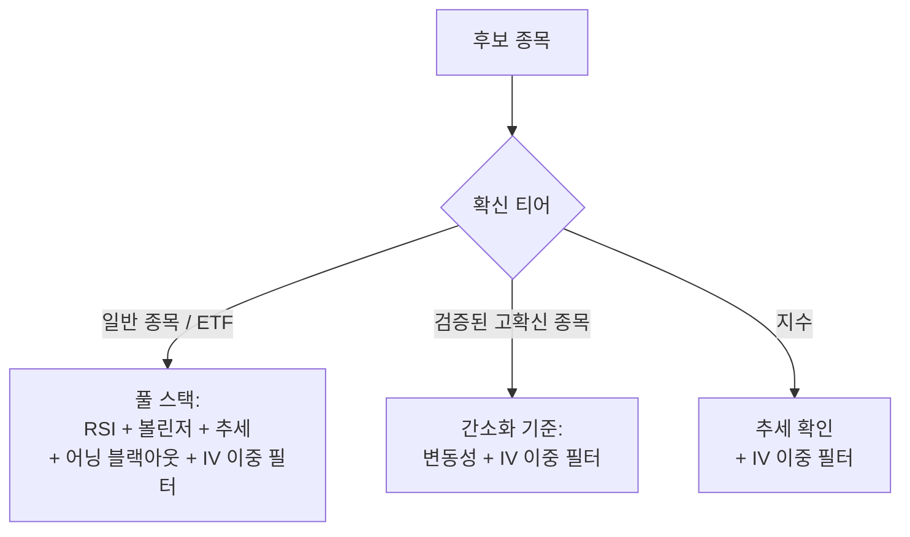
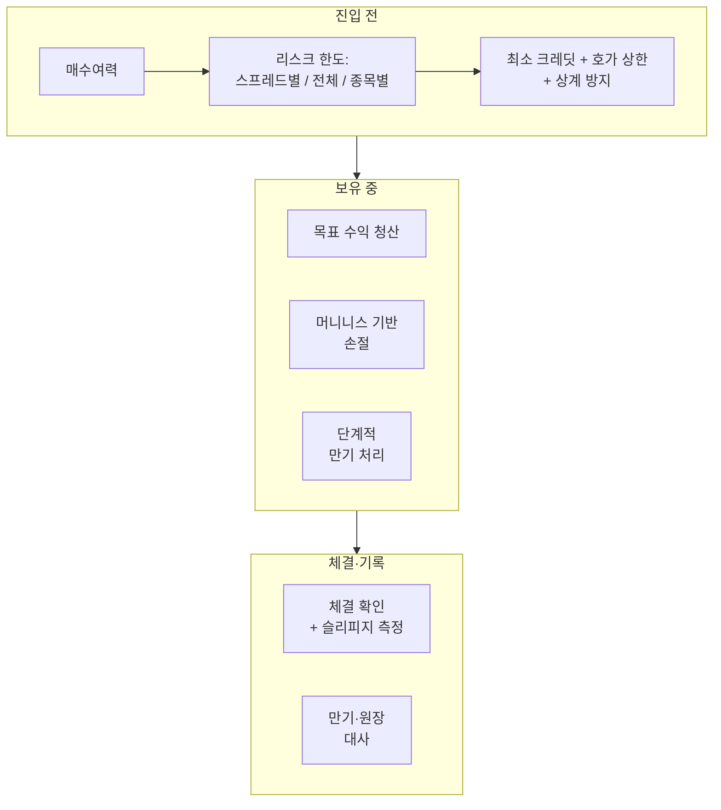

# 옵션 트레이딩 자동화

**풋 크레딧 스프레드 매도 전략을 스크리닝부터 주문 체결, 포지션 관리까지 자동화한 엔드투엔드 파이프라인입니다.**

[](https://github.com/hbchoi0917/trading/actions/workflows/ci.yml)
[](https://options-trading-dash.streamlit.app/)
[](https://www.python.org/)
[](https://tastytrade.com)
[](LICENSE)

[English](README.md) | **한국어**

> 영문 README를 압축한 버전입니다. 세부 내용과 변경 이력은 [영문 README](README.md)를 참고해 주세요.

---

## 레포 구성

| 폴더 | 설명 |
|------|------|
| [`options-screener/`](options-screener/) | **데모 스크리너** — RSI, 볼린저 밴드, IV Rank, IV/HV, 어닝 블랙아웃 필터로 관심 종목을 스캔해 풋 크레딧 스프레드 진입 후보를 뽑고 시그널 CSV로 출력합니다. |
| [`options-analysis/`](options-analysis/) | **매매 분석** — 개인 옵션 거래 내역의 손익, 종목별 성과, 전략 비중, 효율을 분석하는 파이프라인과 차트 |
| [`options-dbt/streamlit_app/`](options-dbt/streamlit_app/) | **라이브 대시보드** — dbt + DuckDB로 모델링한 데이터를 Streamlit·Plotly로 보여주는 3페이지 대시보드. [**→ 대시보드 열기**](https://options-trading-dash.streamlit.app/) |
| [`deploy/`](deploy/) | **서버 셋업** — Ubuntu EC2 원커맨드 셋업, cron 래퍼, 로그 로테이션 |

---

## 개요

풋 크레딧 스프레드 전략의 라이프사이클 전체를 자동화합니다.

1. **스크리닝** — 10개 이상의 기술적·변동성 지표로 승률 높은 진입 후보 선별
2. **주문 실행** — 호가 스프레드가 가장 좁은 장중 유동성 피크 구간에 Tastytrade로 버티컬 스프레드 주문. 장 초반과 마감 직전은 IV가 부풀고 스프레드가 넓어 체결 품질이 떨어지므로 피합니다.
3. **모니터링** — 목표 수익 도달 또는 만기 임박 시 자동 청산
4. **알림** — 진입·청산·에러가 발생할 때마다 Telegram / Gmail 알림
5. **커버드콜** — Fidelity 보유 종목용 커버드콜 알림 모듈 (주문은 수동)



클라우드 서버(AWS EC2)에서 무인으로 돌아가도록 설계했습니다.

> **프로젝트 현황:** 18개월간 재량 매매로 운용하던 전략을 자동화했습니다. 실계좌 전환은 **최소 사이즈 게이트**(리스크가 가장 낮은 단일 종목, 1계약, 동시 보유 포지션 수와 단일 종목 집중 리스크 상한)를 두고, 진입 → 보유 → 청산 사이클을 한 번 온전히 검증한 뒤에만 규모를 늘리는 방식으로 진행했습니다. 현재 무인 사이클을 여러 차례 완료했고, 이후 거래 종목과 리스크 예산도 실제 거래 이력으로 하나씩 검증하며 단계적으로 늘렸습니다.

> **참고:** 이 레포의 스크리너는 **데모/학습용 베이스라인**입니다. 브로커 연동, 주문 실행, 포지션 모니터링, cron 배포까지 포함한 실운영 시스템은 private 레포에서 운영합니다. 완전한 시스템을 만들 때 필요한 사항은 [`screener.py`](options-screener/screener.py) 상단 주석에 정리해 두었습니다.

---

## 스크리닝 로직

종목은 유동성·변동성 프로파일에 따라 티어로 나누고, 모든 시그널은 모멘텀·평균회귀·변동성·어닝 블랙아웃 필터를 통과해야 합니다. RSI와 볼린저 밴드 기준값은 VIX 레짐(LOW / NORMAL / ELEVATED / HIGH)에 따라 자동으로 바뀝니다.

진입 기준은 하나로 통일하지 않고, 검증된 확신 수준에 따라 세 갈래로 나눴습니다.



- **일반 종목 / ETF** — 모멘텀(시간봉 RSI), 평균회귀(볼린저 밴드 위치), 추세, 변동성, 어닝 블랙아웃, IV 이중 필터를 모두 적용합니다.
- **검증된 고확신 종목** — 실거래 이력으로 검증된 소수 종목은 방향성 타이밍 조건 대신 "매도할 만큼 움직임이 있는가, 지금 프리미엄이 역사적으로 싸지 않은가"만 봅니다. 방향 선별력을 일부 내주고 진입 빈도를 얻는 트레이드오프인데, 이미 실제 결과로 검증된 종목에만 적용하고 신규 종목은 풀 스택부터 통과해야 합니다.
- **지수** — 유럽식·현금결제 옵션이라 조기 배정 리스크가 없으므로 RSI 타이밍 조건을 빼고, 장기 추세 확인과 IV 이중 필터만 봅니다. 지수 프리미엄 매도에서 엣지가 있는지 판단하는 건 RSI 위치가 아니라 IV Rank입니다.

### 방법론 노트

- **일봉이 아닌 시간봉 RSI** — 큰 하락일에 일봉 RSI는 중립(~50)으로 나오는데 시간봉 RSI는 과매도를 제대로 보여줍니다. 일봉은 전일 종가를, 시간봉은 지금 시장을 반영하기 때문에 장중 진입 판단에는 시간봉을 씁니다. 장중 데이터가 없으면 일봉으로 폴백합니다.
- **실시간 장중 패치** — 스크리닝 전에 당일 OHLCV 바를 장중 실시간 데이터로 갱신해, 전일 종가가 아닌 현재가 기준으로 시그널을 냅니다.
- **IV 이중 필터** — 1차로 현재 IV가 자기 52주 이력 대비 높은지(IV Rank), 2차로 시장이 최근 실현변동성보다 비싸게 옵션을 사고 있는지(IV/HV)를 봅니다. 둘 다 통과해야 합니다. IV 데이터를 못 받으면 fail-open으로 처리해, 데이터 장애 때문에 정상 진입이 막히지 않게 했습니다.
- **거래당 실현손익 기준 종목 선정** — 거래 종목은 여러 분기의 실제 거래 이력으로 주기적으로 재평가하되, 거래 빈도나 총손익이 아니라 **거래당 실현손익**으로 순위를 매깁니다. 빈도·총액 기준은 거래가 잦고 마진이 얇은 종목을 과대평가하기 쉽기 때문입니다. 구조적으로 부진한 종목은 다른 조건이 완화돼도 계속 제외하고, 한 달 부진과 지속적인 패턴은 구분해서 판단합니다.
- **리스크 한도는 자본이 아니라 종목 구성에 맞춰 확장** — 상관관계가 낮은 종목이 늘어날수록 전체 리스크 예산은 늘릴 수 있지만, 종목 하나가 차지할 수 있는 비중은 오히려 줄입니다. 종목이 늘어난 만큼 특정 종목의 한도만 커지는 일이 없도록 하기 위해서입니다.

---

## 주문 사이징 & 체결

- **종목별 적응형 사이징** — 최고 확신 핵심 종목은 추세가 살아 있을 때 ATM에 더 가까운 델타를 쓰고, 하락 추세로 눌리면 같은 만기에 두 행사가로 나눠 프리미엄을 받는 2단 래더로 전환합니다. IV가 올라간 구간이 곧 프리미엄 매도의 엣지이기 때문입니다. 추세를 벗어난 고확신 종목도 같은 방어형 래더(더 낮은 OTM 델타)를 쓰고, 나머지 종목은 보수적인 원거리 OTM을 타깃으로 합니다.
- **상품군별 최소 크레딧** — 스프레드 폭 대비 프리미엄이 부족하면 리스크 대비 수익이 낮다고 보고 건너뜁니다. 기준은 상품군별로 따로 잡고, 지수 상품도 면제 없이 자체 하한을 둡니다.
- **종목별 일일 진입 한도** — 대부분 종목은 하루 1회, 래더를 쓰는 핵심 종목만 소수 배수까지 허용해 스케줄 실행이 겹쳐 중복 진입되는 것을 막습니다.
- **유동성 피크 타이밍** — 호가 스프레드가 가장 좁은 장중 구간에만 진입합니다.
- **거래소 캘린더 연동** — 주말과 미국 휴장일은 거래소 캘린더로 자동 스킵하고(하드코딩 날짜 없음), 조기 폐장일도 반영합니다.

---

## 리스크 관리

모든 주문은 진입 전후로 결정론적인 다단계 안전장치를 거칩니다. 기본 원칙은 이렇습니다. 디파인드 리스크 크레딧 스프레드는 강제로 청산할 때만 손실이 확정되므로, 청산은 평가손익의 노이즈가 아니라 **포지션이 실제로 위험할 때** 합니다. 반대로 배정으로 이어질 수 있는 상황이면 망설이지 않고 정리합니다.



### 진입 전

- **매수여력 사전 체크** — 주문 전에 필요 증거금을 옵션 매수여력과 대조합니다. API 오류가 나면 브로커 자체 검증에 맡깁니다.
- **다층 리스크 한도** — 스프레드당 최대 리스크, 전체 오픈 리스크 합계, 단일 종목 집중 리스크를 각각 캡으로 관리해 한 종목이 포트폴리오를 좌우하지 못하게 합니다. 고변동성 종목은 계약 수도 따로 제한합니다.
- **최소 크레딧 & 호가 상한** — 폭 대비 프리미엄이 부족하면 스킵합니다. 버티컬 스프레드의 가치는 폭을 넘을 수 없으므로, 계산된 진입가가 폭보다 크면(거래가 뜸한 옵션의 넓거나 오래된 호가라는 신호) 브로커로 보내기 전에 로컬에서 차단합니다.
- **상계(netting) 방지** — 브로커는 동일한 옵션 계약을 합산해서 보여주기 때문에, 새 주문이 기존 포지션을 상계하면 원장도 브로커도 가격을 매기거나 청산할 수 없는 포지션이 생길 수 있습니다. 이런 주문은 거부하고, 상계되지 않는 행사가 공유는 허용합니다.
- **월간 드로다운 서킷브레이커** — 월간 실현손익이 손실 한도에 닿으면 신규 진입을 자동으로 멈춥니다.
- **어닝 블랙아웃 & 쏠림 경고** — 어닝 발표 전후 구간은 진입하지 않고, 상관관계가 높은 종목에서 시그널이 동시에 뜨면 독립적인 거래가 아니라 하나의 매크로 베팅으로 표시합니다.
- **그 외** — 브로커에 이미 미체결 주문이 있는 종목은 다음 실행에서 건너뛰고(중복 진입 방지), 델타가 목표에서 크게 벗어났거나 한쪽 호가만 있는 옵션 데이터는 주문을 만들기 전에 걸러냅니다. 실거래 초기에는 최소 사이즈 롤아웃 게이트를 적용합니다.

### 보유 중

- **목표 수익 청산** — 받은 크레딧의 일정 비율이 소멸하면 자동 청산합니다. 당일 진입·청산이 반복되지 않도록 짧은 최소 보유 기간을 둡니다. 체결이 안 돼 가격을 따라가더라도(price chasing) 실현이익이 목표 아래로 내려가기 전에 멈추고 다음 실행을 기다립니다.
- **머니니스 기반 손절** — 손실이 크레딧의 일정 배수에 도달해도, 숏 레그가 실제로 위협받을 때만 손절합니다. OTM에 여유 있게 있는 포지션의 평가손 급등은 배정 리스크가 아니라 변동성 노이즈이고, 여기서 청산하면 만기 최대수익이 될 포지션을 확정 손실로 바꾸게 됩니다. 머니니스를 확인할 수 없으면(가격 피드 장애 등) 안전한 쪽으로 손절을 실행합니다.
- **만기 직전 수익 확정** — 만기가 가까운 OTM 포지션이 이미 목표 수익에 도달했으면, 마지막 몇 센트를 기다리지 않고 정리합니다.
- **단계적 만기 처리** — 만기가 다가온다고 일괄 강제청산하지 않습니다. 위협받는 포지션에 먼저 회복할 시간을 주고, 이후 매일 카운트다운 알림(수동 롤 타이밍)을 보낸 뒤, 정말 여유가 없을 때만 강제청산합니다. 경고 없이 강제청산하는 일은 없고, 휴장일이나 장애로 알림 구간을 건너뛰었다면 알림부터 보내고 청산은 한 번 미룹니다. 단, 만기일 당일에는 바로 청산합니다.
- **만기일 가드** — 만기 전날부터는 OTM 버퍼를 끕니다. 애매한 이탈이 회복될 시간이 없고, 거래소 자동 행사는 1센트만 ITM이어도 행사로 처리하기 때문입니다. 만기일 당일에는 행사가에서 충분히 떨어져 있어야 안전하다고 봅니다. 간신히 OTM인 숏은 장 마감 전에 ITM으로 넘어가거나, 시간외 움직임으로 행사당할 수 있습니다(핀 리스크). 마감 직전 최종 체크로 막판에 밀리는 포지션도 잡아냅니다.
- **가격 산정 불가 & 배정 알림** — 브로커에서 레그 하나가 사라진 포지션은 남은 레그만으로 평가하지 않습니다. 작은 포지션이 대형 손실로 보일 수 있기 때문입니다. 추측하는 대신 알림을 보내고 건너뜁니다. 숏풋 배정으로 생긴 주식 포지션이나 원장에 없는 옵션 포지션도 알림으로 잡습니다.

### 체결·기록

- **체결 확인 & 가격 추격** — 청산 주문은 실제 주문 상태로 체결을 확인한 뒤에만 체결로 처리합니다. 미체결이면 매도호가 쪽으로 가격을 올려보고, 그래도 안 되면 취소 후 다음 실행에서 재시도합니다. 모든 청산가는 스프레드 폭을 넘지 않습니다.
- **이중 체결 방지** — 재주문 전에 취소가 실제로 성공했는지 확인합니다. 취소 실패는 대개 방금 체결됐다는 뜻이어서, 그대로 재주문하면 포지션이 두 배가 되거나 한쪽 레그만 남습니다.
- **슬리피지 측정** — 청산할 때마다 시장가 기준 예상 비용과 실제 체결 비용을 함께 기록해, 체결 품질을 가정이 아닌 실측으로 관리합니다.
- **만기 포지션 대사** — 만기 후 레그가 사라지면, 배정 주식이 없고 기초자산이 숏 행사가의 안전한 쪽에서 마감한 것이 확인될 때만 무가치 소멸로 기록합니다. 두 레그가 모두 ITM으로 만기된 경우(주식은 남지 않지만 최대 손실)처럼 애매한 건은 수익으로 기록하지 않고 수동 검토로 넘깁니다.
- **원장 기록 & 장애 대응** — 체결은 주문 ID 기준 멱등(idempotent)으로, 파일 락과 atomic replace를 써서 즉시 기록하므로 실행 중 크래시가 나도 원장이 깨지거나 중복 기록되지 않습니다. 일시적인 API·네트워크 오류는 재시도하고, 파이프라인 에러는 이메일로 알립니다. 데드맨 스위치(선택)로 서버가 통째로 죽은 경우도 감지합니다.

---

## 포지션 트래킹

시스템은 직접 연 포지션을 모두 자체 원장(ledger)에 기록하고, 스프레드의 구성에 대해서는 브로커 포지션 목록이 아니라 이 원장을 기준(source of truth)으로 삼습니다.

단순한 이중 관리가 아닙니다. 브로커는 **행사가별 순수량**만 보여주기 때문에, 두 스프레드가 행사가를 공유하는 순간(의도적인 래더 패턴) 어떤 롱이 어떤 숏의 짝인지 브로커 데이터로는 복원할 수 없습니다. 이 모호함은 포지션 수, 청산 주문, 손익에 그대로 옮겨갑니다. 그래서 스프레드 구성은 원장이 기준이고, 브로커에서는 브로커만 아는 정보(실시간 평가가, 배정 주식, 원장에 없는 포지션)만 가져옵니다.


- **호가가 아닌 체결가로 기록** — 진입 재시도 루프가 장중에 지정가를 조금씩 낮추기 때문에, 실제로 받은 크레딧은 대개 처음 주문을 낼 때의 호가보다 낮습니다. 원장에는 체결가를 기록합니다.
- **비용 차감 후 손익** — 실현손익은 수수료를 뺀 값이고, 이 값이 그대로 드로다운 서킷브레이커에 들어갑니다. 수수료 전 금액을 쓰면 계좌가 실제보다 안전해 보여서 의도보다 큰 리스크를 지게 됩니다.
- **매 실행마다 대사** — 원장과 브로커를 두 레그 모두 행사가별 부호 있는 순수량으로 비교하고, 불일치가 있으면 알림과 함께 이후 손익을 전부 '신뢰 불가'로 표시해 사람이 확인하게 합니다. 직접 넣은 롤 같은 수동 개입도 여기서 바로 잡혀 원장에 청산 + 신규 진입으로 반영됩니다.
- **만기 포지션 정리** — 만기 결과가 확인되면 원장에서 닫아, 리스크 예산을 풀고 결과를 실현손익에 반영합니다.
- **Fail-closed** — 정상적인 스프레드로 파싱되지 않는 원장 행은 추측하지 않고 건너뛰고, 원장이 비어 있으면 아무것도 청산하지 않습니다. 여기서 레그를 잘못 읽으면 그대로 잘못된 실주문이 되기 때문입니다.

---

## 실거래 전환 안전장치

백테스트에서 실계좌로 넘어가는 구간은 조용히 돈을 잃는 버그가 숨기 좋은 곳이라, 실주문 경로는 기본값이 안전한 플래그 뒤에 두었습니다.

- **기본값 ON인 두 개의 안전 플래그** — 드라이런(주문 없이 로그만 남김)과 페이퍼 라우팅입니다. 실주문은 드라이런을 끄고 *동시에* 라이브 엔드포인트를 선택해야만 나가므로, 실수로 켜질 일이 없습니다.
- **샌드박스 ≠ 페이퍼 계좌** — 브로커의 인증/API 연동용 샌드박스는 지속형 페이퍼 트레이딩 계좌가 **아닙니다**. 주기적으로 초기화돼 포지션이 사라질 수 있고 체결도 현실적이지 않은 규칙 기반이라, 연동 검증은 되지만 몇 주짜리 전략 검증은 못 합니다. 샌드박스를 가리키면서 페이퍼 트레이딩으로 인식하는 설정이면 헬스체크가 하드 실패하고, 접속할 때마다 경고 로그를 남기도록 했습니다. *(실제로 한 번 겪은 실수라서 생긴 가드입니다.)*
- **최소 사이즈 롤아웃 게이트** — 실계좌 첫 단계는 일부러 결과에 영향이 없을 만큼 작게 시작합니다.

---

## 운영 스케줄

모든 작업은 미국 동부시간(ET) 기준 평일에 돌고, 주말과 미국 휴장일은 거래소 캘린더로 자동 스킵합니다.

| 시간 (ET) | 작업 |
|-----------|------|
| 프리마켓 | 헬스체크 — 인증정보 / 의존성 / 네트워크 점검, 실패 시 이메일 |
| 오전 늦게 | 모니터링 — 장 초반이 안정된 뒤 목표 수익 / DTE 체크 |
| 정오 무렵 | 진입 — 스크리너 실행 + 주문 (유동성 피크 구간) |
| 이른 오후 | 진입 — 유동성 구간 안에서 오후 재스크리닝 |
| 오후 중반 | 모니터링 — 장중 목표 수익에 도달한 포지션 청산 |
| 오후 늦게 | 커버드콜 알림 (Fidelity에서 수동 주문) |
| 장 마감 후 | 요약 — 일간 이메일, 주 마지막 거래일엔 주간 이메일, 데드맨 핑(선택) |

---

## 설계 원칙: AI가 아닌 룰 기반

증권사들이 AI가 사용자 대신 매매하는 기능을 내놓고 있지만, 그 손실 책임은 아직 법적으로 회색지대입니다. 이 시스템은 의도적으로 반대 구조를 택했습니다. 기술적 한계가 아니라 설계상의 선택입니다.

| | 이 시스템 (룰 기반) | 퀀트 (통계 기반) | AI (LLM/ML 판단) |
|--|--|--|--|
| 판단 근거 | 명시적 기준값 | 데이터에서 도출한 공식 | 확률 모델의 출력 |
| 재현성 | 완전 | 완전 (같은 데이터 → 같은 결과) | 보장 안 됨 |
| 설명 가능성 | 코드 한 줄 단위 | 명시적 공식 | 사실상 불가능 |
| 책임 소재 | 100% 소유자 | 100% 소유자 | 회색지대 |

**룰 기반을 택한 이유**

1. **엣지는 예측이 아니라 구조에서 나옵니다.** 프리미엄 매도는 변동성 리스크 프리미엄(내재변동성이 실현변동성을 꾸준히 웃도는 현상)에서 수익이 납니다. 방향 예측보다는 보험을 파는 것에 가깝고, 예측 모델이 더해줄 게 많지 않습니다.
2. **ML을 쓰기엔 샘플이 너무 작습니다.** 한 달에 몇 건 수준의 거래로는 모델을 학습시키기는커녕 검증도 할 수 없습니다. 과적합이 뻔합니다.
3. **감사 가능성(auditability)이 곧 경쟁력입니다.** 모든 진입과 청산이 명시적인 룰로 추적됩니다. 포지션 간 레그 짝 오류, 당일 진입·청산 반복, OTM에 안전하게 있던 포지션이 변동성 노이즈에 청산되는 문제 같은 미묘한 체결 버그는 로직이 결정론적이었기 *때문에* 찾을 수 있었습니다. 확률적 판단이었다면 "버그인가, 모델의 판단인가?"를 가릴 수 없었을 겁니다.
4. **책임 소재가 명확합니다.** 룰도, 계좌도, 리스크 한도도 모두 소유자의 것이므로 손실 책임도 분명히 소유자에게 있습니다. 증권사 AI처럼 수탁 책임이 모호해질 일이 없습니다.

**AI가 실제로 도움이 될 영역, 그리고 아직 넣지 않은 이유**

룰 기반은 AI를 배척하는 게 아니라, 작은 샘플·감사 가능성·실자금이라는 제약 아래서 AI를 어디에 쓸지 범위를 정한 결과입니다. 진입/청산 판단 룰과는 분리해서, 아래 영역은 추후 도입 후보입니다.

- **관심 종목 어닝·뉴스 감성 분석** — 이상 감성 변화를 NLP로 잡아, 지금은 고정인 어닝 블랙아웃 구간을 종목별로 넓히는 용도
- **변동성·섹터 상관관계 레짐/이상 탐지** — 비지도 모델로 "학습 이력과 다른 시장 상황"을 감지해, 결정론적 게이트를 대체하지 않고 그 위에 추가 일시정지 신호로 사용
- **백테스트 기반 기준값 튜닝** — 실데이터를 보며 수동으로 보정하는 대신 파라미터 공간을 체계적으로 탐색하되, 결과물은 여전히 고정되고 감사 가능한 룰

셋 다 기준값이 정해진 뒤 매매 판단이 *어떻게* 내려지는지는 바꾸지 않습니다. 그 부분은 위의 책임 문제 때문에 결정론적으로 유지합니다. 룰에 들어가는 입력을 개선하는 것이고, 확률 모델이 매매 판단 자체에 들어가는 것보다 훨씬 부담이 적은 자리입니다.

**채택한 발전 방향은 AI가 아니라 퀀트 방식입니다.** 거래 원장에 이력이 쌓이면 고정 기준값을 데이터 기반으로 바꿀 수 있습니다. 변동성 순위 기반 델타 조정, 실현 승률 기반 종목별 사이징, ATR 기반 스프레드 폭 선택 같은 것들로, 모두 명시적 공식이고 백테스트와 재현이 가능합니다. 이미 적용 중인 VIX 레짐별 기준값 조정이 그 첫 단계입니다. LLM 기반 매매 판단은 이 전략에서 영구히 제외합니다.

---

## 빠른 시작

```bash
# 1. 의존성 설치
cd options-screener
pip install -r requirements.txt

# 2. 스크리너 실행
python screener.py
# → signals_YYYYMMDD.csv + 콘솔 출력
```

완전 자동화까지 하려면 다음이 추가로 필요합니다.
- **브로커 API** — Tastytrade, IBKR 등과 연동해 주문 실행
- **클라우드 서버** — AWS EC2 등에 배포하고 미국 동부시간 기준 cron 스케줄링
- **알림** — Telegram / Gmail 알림 연동

---

## 기술 스택

- **[yfinance](https://pypi.org/project/yfinance/)** — 시장 데이터, 옵션 체인
- **[pandas](https://pandas.pydata.org/)** — 데이터 처리
- **[tastytrade](https://pypi.org/project/tastytrade/)** ≥ 12.0 — 브로커 SDK (실운영)
- **[pandas-market-calendars](https://pypi.org/project/pandas-market-calendars/)** — NYSE 휴장일·조기 폐장 캘린더 (실운영)
- **[python-dotenv](https://pypi.org/project/python-dotenv/)** — 인증정보 관리

분석 쪽: **dbt** · **DuckDB** · **Streamlit** · **Plotly** ([`options-dbt/`](options-dbt/) 참고)

---

## 라이선스

개인 사용 전용입니다. 상업적 이용과 재배포는 허용하지 않습니다. [LICENSE](LICENSE)를 참고해 주세요.

---

## 면책 조항

개인 사용 및 학습 목적으로만 제공합니다. 투자 조언이 아니며, 옵션 거래에는 상당한 손실 위험이 따릅니다.
