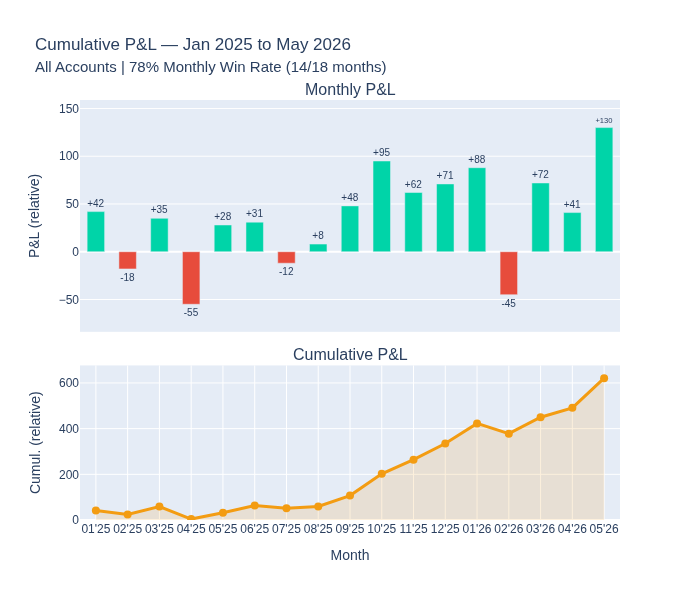
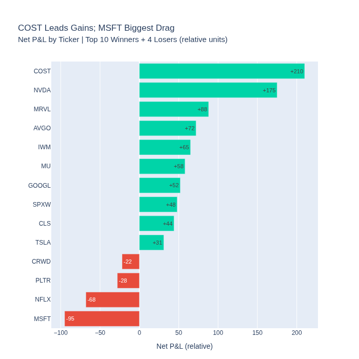
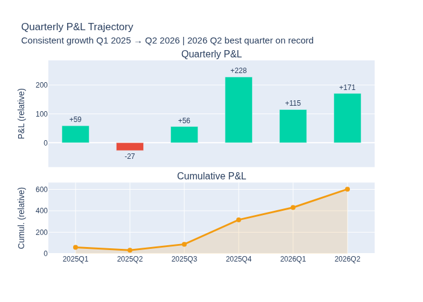
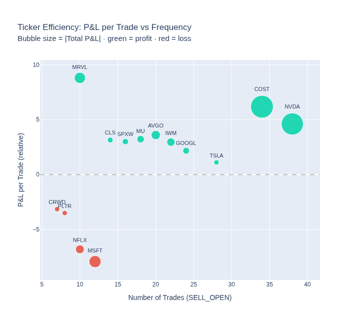
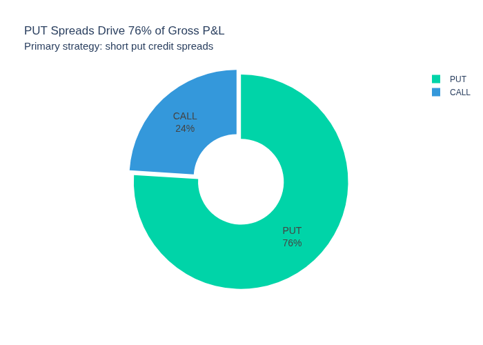

# Options Trading Analysis (Jan 2025 – May 2026)

## Overview
This folder contains the analysis pipeline and insights derived from personal options trading transaction data (January 1, 2025 – May 29, 2026) across four brokerage accounts (Account A, B, C, D).

---

## Folder Structure

```
options-analysis/
├── data/
│   ├── Accounts_History*.csv    # Raw Fidelity export files (add manually, do NOT commit)
│   └── options_cleaned.csv      # Auto-generated by analysis.py
├── charts/                      # PNG charts (9 total) — sample set committed
├── analysis.py                  # Full pipeline: load → clean → analyze → visualize
├── generate_sample_charts.py    # Generates charts/ from synthetic data (for display)
├── insights_report.md           # Key findings & action plan
└── README.md
```

---

## Key Stats (Jan 2025 – May 2026)

| Metric | Value |
|---|---|
| Monthly Win Rate | **78%** (14 / 18 months profitable) |
| Primary Strategy | Put Credit Spreads |
| Accounts | 4 (Individual + IRA types) |
| Period | Jan 2025 – May 2026 |

> Specific P&L figures are maintained in a private repository.

---

## How to Run

```bash
# 1. Install dependencies
pip install pandas plotly kaleido

# 2. Copy Fidelity CSV exports into data/
cp ~/Downloads/Accounts_History*.csv data/

# 3. Run full pipeline
python analysis.py
# → Prints summary stats to console
# → Saves data/options_cleaned.csv
# → Saves 9 charts to charts/
```

---

## Sample Charts

> Charts below are generated from synthetic data that reflects the narrative patterns in
> [`insights_report.md`](insights_report.md). Actual P&L figures are in a private repository.
> To generate from your own data, run `python analysis.py` after adding CSV exports to `data/`.

### Monthly P&L + Cumulative Growth


### Net P&L by Ticker


### Quarterly Trajectory


### Ticker Efficiency (P&L per Trade vs Frequency)


### Strategy Split — PUT vs CALL


<details>
<summary>All 9 charts</summary>

| File | Description |
|---|---|
| `chart1_monthly_pnl.png` | Monthly P&L bars + cumulative growth line |
| `chart2_ticker_pnl.png` | Net P&L by ticker (top winners + losers) |
| `chart3_put_vs_call.png` | PUT vs CALL strategy P&L split |
| `chart4_trade_count.png` | Monthly trade frequency trend |
| `chart5_account_pnl.png` | Net P&L by account type |
| `chart6_weekday_pnl.png` | P&L by day of week |
| `chart7_ticker_frequency.png` | New positions opened by ticker |
| `chart8_quarterly_pnl.png` | Quarterly P&L bars + cumulative growth line |
| `chart9_ticker_efficiency.png` | P&L per trade vs trade frequency scatter |

</details>
